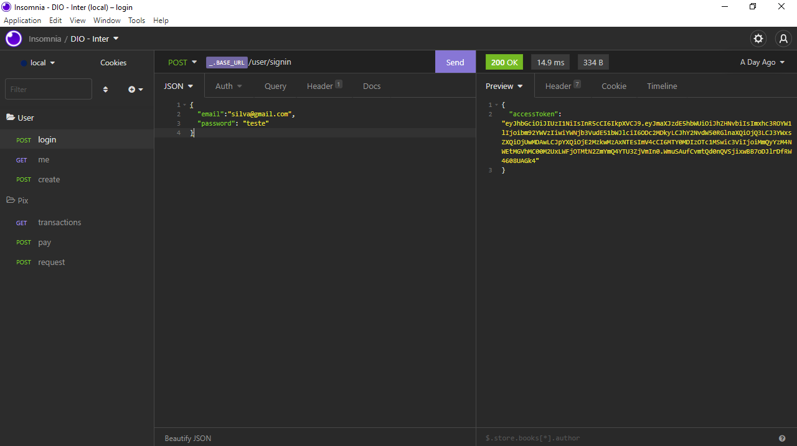

<h1 align="center">
    Backend da aplicação Inter-Dio
</h1>
<h1 align="center">
    
</h1>
 
 

Para acessar as rotas da aplicação e testar cada método, foi utilizado o software Insomnia: https://insomnia.rest/download

A baixo está descrito cada rota existente na aplicação:

1º) Referente ao User ( "/user" ):

- Fazer login com email e senha: http://localhost:3333/user/signin
- Criar novo usuário: http://localhost:3333/user/signup. 
- Obter as informações do usuário: http://localhost:3333/user/me.

2º) Referente ao Pix ( "/pix" ):

- Solicitação de pix: http://localhost:3333/pix/request
- Realizar um pix: http://localhost:3333/pix/pay/:key -> key sendo o token de identificação do usuário beneficiado pelo depósito. 
- Obter todas as transações realizadas por um usuário: http://localhost:3333/pix/transactions.

## 🧪 Technologies

Foram utilizadas nesse projeto as seguintes tecnologias:

- [Node.js](https://nodejs.org/en/)
- [Express](https://expressjs.com/pt-br/)
- [TypeScript](https://www.typescriptlang.org/)
- [Docker](https://www.docker.com/)  
- [TypeOrm](https://typeorm.io/#/)
- [JsonWebToken](https://www.npmjs.com/package/jsonwebtoken)